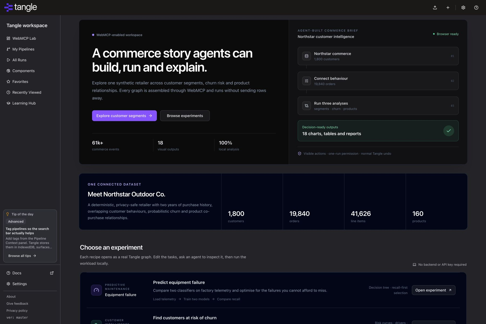

# Tangle app (Frontend)

Tangle is a web app that allows the users to build and run Machine Learning pipelines using drag and drop without having to set up development environment.

[](https://tangleml-tangle.hf.space/#/quick-start)

## WebMCP hackathon demo

This branch turns Tangle into a WebMCP workspace for practical machine learning.
A person can ask an agent to help with work such as predictions, churn,
forecasting, customer groups, or product relationships. The agent builds on the
same visible canvas, the person approves each run, and imported rows stay inside
the page.



- Public hosted build: <https://tangle-webmcp.ian347727.chatgpt.site>
- Public source: <https://github.com/ihansel/tangle-webmcp>
- Architecture: [docs/webmcp-architecture.md](docs/webmcp-architecture.md)
- Upstream baseline and attribution: [UPSTREAM.md](UPSTREAM.md)
- Submission evidence and judge guide: [submission/README.md](submission/README.md)

### Why WebMCP

Visual browser automation would have to scrape node labels and guess coordinates.
Here the page instead registers structured, discoverable tools with
`document.modelContext.registerTool`. Stable task IDs, bounded schemas, explicit
errors, and concise return values let an agent perform multi-step work while the
person can see every graph mutation, approve execution, review the report, and
undo changes normally.

The registered tools are:

`get_pipeline_summary`, `search_components`, `add_pipeline_tasks`,
`configure_task`, `connect_tasks`, `validate_pipeline`, `run_browser_pipeline`,
`get_run_summary`, `inspect_model_metrics`, and `undo_pipeline_change`.

### Retail demo workflows

- Compare two prediction methods to spot customers who may leave.
- Group 1,800 synthetic retail customers by shopping behaviour.
- Learn which products are bought together and surface similar items.
- Review charts and operational recommendations produced entirely in the browser.

Example agent prompts:

- “Inspect the open pipeline, validate it, and tell me what can run locally.”
- “Add a CSV loader and selector, connect them, then show me the updated graph.”
- “After I allow the next run, run this pipeline and compare classifier recall.”
- “Undo your most recent graph change.”

### Run and test this branch

Use Node.js, pnpm 10.28.0, and the committed lockfile:

```sh
pnpm install --frozen-lockfile
pnpm start
```

No backend or API key is required for the curated local demos. With a supporting
client, open an experiment in the v2 editor to discover the WebMCP tools. To run
the verification suite:

```sh
NODE_OPTIONS=--no-webstorage pnpm test
pnpm lint
pnpm typecheck
pnpm build
```

`--no-webstorage` avoids Node 25's incomplete built-in Web Storage globals so the
jsdom test environment can install its own implementation. The browser runner is
deliberately limited to the curated components above; it does not execute
arbitrary Python, component YAML, containers, shell commands, or every component
supported by upstream Tangle. The generated Northstar Commerce dataset is
synthetic and documented in
[public/datasets/northstar-commerce/provenance.md](public/datasets/northstar-commerce/provenance.md).

This is the frontend repo. It contains the entire user interface portion of the app. It is built primarily on Typescript + React + Tailwind CSS, and powered by NodeJS + Vite.

> Go to the [backend repo](https://github.com/TangleML/tangle).

## Demo

[Demo](https://tangleml-tangle.hf.space/#/quick-start)

The experimental new version of the Tangle app is now available at <https://tangleml-tangle.hf.space/#/quick-start> . No registration is required to experiment with building pipelines. To install your own app instance, [duplicate](https://huggingface.co/spaces/TangleML/tangle?duplicate=true) the HuggingFace space or follow the [backend installation instructions](https://github.com/Cloud-Pipelines/backend?tab=readme-ov-file#installation).

Please check it out and report any bugs you find using [GitHub Issues](https://github.com/TangleML/tangle/issues).

The app is under active development and supported by its maintainers.

## Installation

**tangle-ui** can be operated and developed independently of the backend.

### Standalone Web App - Instructions

1. Install [Node](https://nodejs.org/) and [pnpm](https://pnpm.io/installation)
2. Fork the `tangle-ui` repo - we recommend colocating the repo with the backend
3. Navigate to the forked repo and install dependencies with `pnpm install`
4. You are now ready to go! Run the app with `pnpm start` 🚀

You can now run tangle-ui as a standalone web app! Pipelines and data will be stored in browser storage. If you want to make use of backend features, such as executing runs you will need to connect to a backend.

### Integrated Web App - Instructions

1. Complete the steps above
2. Complete the installation steps for the backend as specified in the [backend repo](https://github.com/TangleML/tangle)
3. Create a `.env` file at the root of `tangle-ui`
4. Add an env variable `VITE_BACKEND_API_URL` with the url where your backend is hosted (most likely `http://127.0.0.1:8000`)
5. Run the backend & restart the frontend app

<!-- todo: CORS -->

You should now be running Tangle in its entirety and can enjoy its full suite of features!

If you find you are blocked by CORS, you will, for now, need to use the manual steps below.

#### If all Else Fails

1. Complete the installation steps for the backend as specified in the [backend repo](https://github.com/TangleML/tangle)
2. Co-locate your local `tangle-ui` repo inside your local `tangle` repo
3. Run `pnpm run build` inside `tangle-ui`
4. Start the backend using the provided instructions in the `tangle` repo

If you complete these steps the app will launch on `127.0.0.1:8000` with the latest build you've created on the frontend.

### Environment Variables

Add these to a `.env` file at the root of `tangle-ui`.

| Variable                       | Required             | Description                                                                                                                                            |
| ------------------------------ | -------------------- | ------------------------------------------------------------------------------------------------------------------------------------------------------ |
| `VITE_BACKEND_API_URL`         | For backend features | URL of your Tangle backend (e.g. `http://127.0.0.1:8000`).                                                                                             |
| `VITE_ARTIFACT_RETENTION_DAYS` | No                   | Number of days artifacts are stored by your backend. When set, the UI shows artifact expiry dates and warns when artifacts may no longer be available. |
| `VITE_BUGSNAG_API_KEY`         | No                   | Bugsnag API key. Required alongside `VITE_TANGLE_ENV` to enable error reporting.                                                                       |
| `VITE_TANGLE_ENV`              | No                   | Release stage passed to Bugsnag (e.g. `development`, `staging`, `production`).                                                                         |

## App features:

- Build and edit pipelines using drag and drop visual editor
- Configure component arguments
- Submit the pipeline for execution. (Follow the [backend installation instructions](https://github.com/TangleML/tangle?tab=readme-ov-file#installation).)
- The ComponentSpec/`component.yaml` format used by Cloud Pipelines is fully compatible with the Google Cloud Vertex AI Pipelines and Kubeflow Pipelines v1. You can find many components here: [Ark-kun/pipeline_components](https://github.com/Ark-kun/pipeline_components/)
- Preloaded component library
- User component library (add private components)
- Remote component library
- GitHub-based libraries
- [Component discovery and search](docs/component-discovery.md)
- Import and export pipelines
- Create subgraphs and nested pipelines
- In-app component editor
- Disable cache
- Cancel executions
- Clone pipelines and review ongoing executions (logs, artifacts, run status)

Feel free to provide feedback, flag and issue or make a suggestion: [issues](https://github.com/TangleML/tangle-ui/issues).

## Credits:

This app is based on the [Pipeline Editor](https://cloud-pipelines.net/pipeline-editor) app created by [Alexey Volkov](https://github.com/Ark-kun) as part of the [Cloud Pipelines](https://github.com/Cloud-Pipelines) project.
